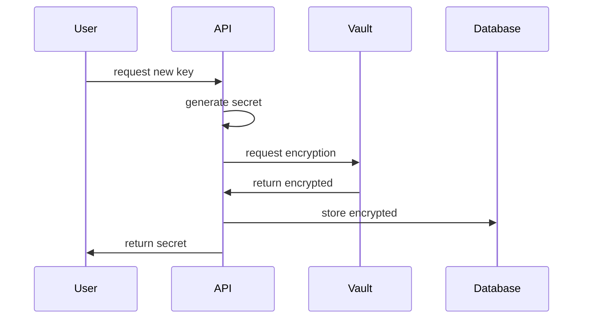

import { Accordion, Accordions } from "fumadocs-ui/components/accordion"

# Vault 加密服务架构

## 概述

Vault是Unkey的加密管理服务，负责：
1. 加密密钥的全生命周期管理
2. 提供加密和解密功能
3. 实现安全的密钥存储策略

特别说明：Vault本身不存储密钥原文，这是一个重要的安全设计决策。

## 技术实现

### 部署形式
- 单一二进制文件
- 容器化部署
- 依赖S3兼容的存储后端

### 核心功能

1. **加密服务**
   - 密钥加密与解密
   - 支持多种加密算法
   - 安全的密钥传输

2. **密钥管理**
   - 多密钥环(keyring)支持
   - 密钥轮换机制
   - 自动重新加密

3. **服务接口**
   - 基于buf connect的HTTP API
   - 安全的RPC调用
   - 完整的API文档

## 工作流程

## 安全设计

### 分离存储原则

Vault采用分离存储策略，不将密钥原文与加密密钥存储在同一位置。原因：

1. **降低安全风险**
   - 防止单点突破导致全系统沦陷
   - 增加攻击者获取有效数据的难度
   - 实现纵深防御

2. **数据分布**
   - 加密后的密钥存储在主数据库
   - 加密密钥（经加密）存储在Vault
   - Vault从不对外泄露加密密钥

### 风险场景分析

<Accordions>
  <Accordion title="场景1：主数据库泄露">
    - 影响：攻击者可以看到加密后的密钥
    - 防护：无法解密，因为缺少加密密钥
    - 结果：数据仍然安全
  </Accordion>

  <Accordion title="场景2：Vault数据库泄露">
    - 影响：攻击者可以看到加密的加密密钥
    - 防护：无法解密，因为缺少主密钥
    - 结果：加密系统仍然安全
  </Accordion>

  <Accordion title="场景3：Vault数据库和主密钥泄露">
    即使在最严重的情况下：
    - 攻击者获得了Vault数据库
    - 攻击者获得了主密钥
    - 可以解密加密密钥
    
    但仍然：
    - 无法访问主数据库中的加密数据
    - 无法完成完整的解密链条
    - 系统的核心数据仍然安全
  </Accordion>
</Accordions>

## 技术选型

### 为什么选择容器而不是Cloudflare Workers？

考虑因素：

1. **缓存需求**
   - 加密服务需要高效的本地缓存
   - 需要维护加密密钥的状态
   - Workers无状态特性不适合此场景

2. **性能考虑**
   - 容器可以利用本地资源
   - 减少网络延迟
   - 提供更稳定的性能

3. **部署灵活性**
   - 支持多种部署方式
   - 便于本地开发和测试
   - 容易集成到现有基础设施

## 最佳实践

1. **密钥管理**
   - 定期轮换加密密钥
   - 实施最小权限原则
   - 建立密钥备份机制

2. **监控和审计**
   - 记录所有加密操作
   - 监控异常访问模式
   - 定期安全审查

3. **灾难恢复**
   - 制定密钥恢复流程
   - 定期演练恢复程序
   - 保持文档更新
